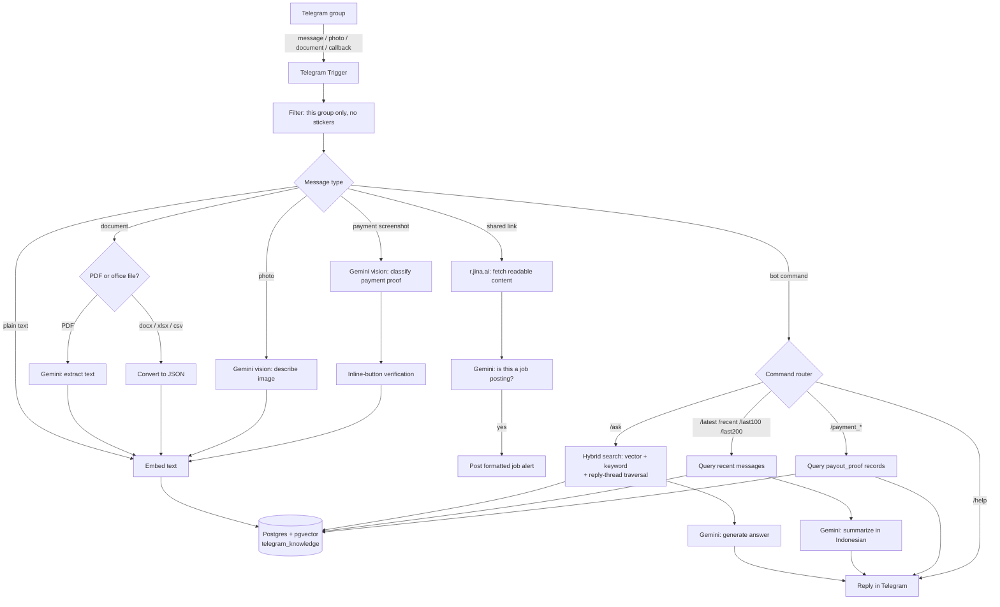

# Telegram RAG Bot

A Telegram group assistant built as an [n8n](https://n8n.io) workflow. It silently ingests everything shared in the group — text, images, PDFs, and office documents — into a vector-searchable knowledge base, then answers questions about it, summarizes recent chat, auto-detects job postings, and tracks payment/payout proof shared by members.

No custom backend — the entire system is one n8n workflow, using Google Gemini for generation/embeddings and Postgres + pgvector for retrieval.

## Why

Fast-moving Telegram groups (freelance/job communities, in this case) bury useful information — job leads, payment confirmations, decisions — under constant chat noise. This bot turns the group's own history into a searchable knowledge base and highlights the parts worth surfacing (job posts, verified payments) automatically.

## Features

| Command | What it does |
|---|---|
| `/ask <question>` | Retrieval-augmented Q&A over the group's full history (see [How retrieval works](#how-retrieval-works)) |
| `/latest` | Summarizes the last 3 hours of chat |
| `/recent` | Summarizes the last 6 hours of chat |
| `/last100` / `/last200` | Summarizes the last 100 / 200 messages |
| `/payment_latest` | Latest 10 verified payments/payouts |
| `/payment_this_month` / `/payment_last_month` | Payment records for that period |
| `/help` | Lists all commands |

Plus two things that happen automatically, with no command needed:

- **Job posting detection** — any link shared in the group is fetched and read (via [r.jina.ai](https://r.jina.ai)), classified by Gemini as a job/gig posting or not, and — if it is — reposted as a formatted alert with role, platform, rate, and description extracted.
- **Payment tracking** — screenshots of payout/payment proof are classified by Gemini vision (verified / pending / invoice / not-a-payment, rejecting social-media reposts and product ads that just *look* like payment screenshots), pass through an inline-button verification step, and get logged for the `/payment_*` commands.

Every message, image, and document is also embedded and stored in the background regardless of command, which is what makes `/ask` possible.

## Architecture



### How retrieval works

`/ask` doesn't do plain vector search. Each query:

1. Is embedded with Gemini (`gemini-embedding-001`)
2. Runs two searches in parallel — **vector similarity** (pgvector, via a `match_documents_v2` SQL function) and **keyword full-text search** (Postgres `tsquery`)
3. Merges both result sets with **Reciprocal Rank Fusion**, so a message that scores well on either signal ranks highly
4. Walks the reply-chain graph (a recursive CTE over `reply_to_message_id`) up to 10 levels in both directions from every top result, so a terse reply pulls in the question it was answering and vice versa
5. Feeds the assembled context + source links to Gemini to generate a direct answer, with an "AI-generated answers may be inaccurate" disclaimer appended

## Tech stack

- **[n8n](https://n8n.io)** — workflow orchestration (the entire bot is one workflow, no custom server)
- **Telegram Bot API** — trigger, messages, inline keyboards
- **Google Gemini** (`gemini-3.1-flash-lite`, `gemini-embedding-001`) — chat, vision (image/PDF), classification, and embeddings
- **PostgreSQL + pgvector** — hybrid vector/keyword knowledge store (`telegram_knowledge` table)
- **[r.jina.ai](https://r.jina.ai)** — readable-content extraction for shared links
- **[@mazix/n8n-nodes-converter-documents](https://www.npmjs.com/package/@mazix/n8n-nodes-converter-documents)** — community node for converting office documents (docx/xlsx/csv) to text

## Database setup

The knowledge store is plain **Postgres with the `pgvector` extension** — any host that offers that works (a managed Postgres provider, self-hosted, etc.). No vendor-specific features are used.

```sql
-- 1. Enable the vector extension
CREATE EXTENSION IF NOT EXISTS vector;

-- 2. Core knowledge table
CREATE TABLE telegram_knowledge (
  id         BIGINT GENERATED BY DEFAULT AS IDENTITY PRIMARY KEY,
  content    TEXT NOT NULL,               -- "Firstname (@username): message | image description"
  metadata   JSONB DEFAULT '{}'::jsonb,   -- message_id, reply_to_message_id, thread_id, chat_id, sender_name, source, etc.
  embedding  VECTOR(3072),                -- output of models/gemini-embedding-001
  created_at TIMESTAMPTZ DEFAULT NOW()
);

-- 3. Derived columns, kept in sync via trigger, so hot filters (chat/thread/reply lookups)
--    and full-text search don't have to reach into the metadata JSONB on every query
ALTER TABLE telegram_knowledge ADD COLUMN message_id BIGINT;
ALTER TABLE telegram_knowledge ADD COLUMN reply_to_message_id BIGINT;
ALTER TABLE telegram_knowledge ADD COLUMN chat_id BIGINT;
ALTER TABLE telegram_knowledge ADD COLUMN content_tsv TSVECTOR;

CREATE OR REPLACE FUNCTION tk_derive_ids() RETURNS trigger AS $$
BEGIN
  NEW.message_id := CASE WHEN NEW.metadata->>'message_id' ~ '^-?\d+$' THEN (NEW.metadata->>'message_id')::bigint END;
  NEW.reply_to_message_id := CASE WHEN NEW.metadata->>'reply_to_message_id' ~ '^-?\d+$' THEN (NEW.metadata->>'reply_to_message_id')::bigint END;
  NEW.chat_id := CASE WHEN NEW.metadata->>'chat_id' ~ '^-?\d+$' THEN (NEW.metadata->>'chat_id')::bigint END;
  NEW.content_tsv := to_tsvector('simple', COALESCE(NEW.content, ''));
  RETURN NEW;
END;
$$ LANGUAGE plpgsql;

DROP TRIGGER IF EXISTS tk_derive_ids_trigger ON telegram_knowledge;
CREATE TRIGGER tk_derive_ids_trigger
BEFORE INSERT OR UPDATE OF metadata, content ON telegram_knowledge
FOR EACH ROW EXECUTE FUNCTION tk_derive_ids();

-- 4. Indexes
-- Vector search: HNSW over a half-precision cast — a plain `vector` index caps out around
-- 2,000 dimensions, and Gemini's embeddings here are 3072-dim, so halfvec is what makes an
-- HNSW index possible at all.
CREATE INDEX idx_telegram_knowledge_embedding
  ON telegram_knowledge
  USING hnsw ((embedding::halfvec(3072)) halfvec_cosine_ops);

-- Keyword search
CREATE INDEX idx_tk_content_tsv ON telegram_knowledge USING gin(content_tsv);

-- 5. Hybrid search function used by /ask
CREATE OR REPLACE FUNCTION match_documents_v2(
  query_embedding VECTOR(3072),
  match_count INT DEFAULT 5,
  filter_chat_id BIGINT DEFAULT NULL
)
RETURNS TABLE (id BIGINT, content TEXT, metadata JSONB, created_at TIMESTAMPTZ, similarity FLOAT)
LANGUAGE plpgsql AS $$
BEGIN
  RETURN QUERY
  SELECT
    telegram_knowledge.id, telegram_knowledge.content, telegram_knowledge.metadata,
    telegram_knowledge.created_at,
    1 - ((telegram_knowledge.embedding::halfvec(3072)) <=> (query_embedding::halfvec(3072))) AS similarity
  FROM telegram_knowledge
  WHERE filter_chat_id IS NULL OR telegram_knowledge.chat_id = filter_chat_id
  ORDER BY (telegram_knowledge.embedding::halfvec(3072)) <=> (query_embedding::halfvec(3072))
  LIMIT match_count;
END;
$$;
```

The `/ask` keyword search (see [How retrieval works](#how-retrieval-works)) queries `content_tsv` directly with `to_tsquery('simple', ...)`; the reply-thread traversal walks `message_id` / `reply_to_message_id` / `chat_id` on the same table via a recursive CTE — no separate tables needed.

## Setup

1. Install the community node **[@mazix/n8n-nodes-converter-documents](https://www.npmjs.com/package/@mazix/n8n-nodes-converter-documents)** in your n8n instance (Settings → Community Nodes) — it's what converts non-PDF office documents (docx/xlsx/csv) to text before embedding. Required before importing, or the "Convert File to JSON" node will fail to load.
2. Import [`workflow/telegram-rag-bot.workflow.json`](workflow/telegram-rag-bot.workflow.json) into your n8n instance.
3. Create a Telegram bot via [@BotFather](https://t.me/BotFather) and add its credential in n8n (Telegram API credential — do **not** hardcode the token in a node, as the original export mistakenly did in a few HTTP Request nodes).
4. Get a Google Gemini API key from [Google AI Studio](https://aistudio.google.com/) and add it as:
   - A **Google Gemini (PaLM) API** credential in n8n (used by most nodes), and
   - The environment variable `GEMINI_API_KEY` on your n8n instance (used by the raw HTTP "Embed Question" node — set this before running, since the exported workflow references `{{ $env.GEMINI_API_KEY }}`).
5. Also set `TELEGRAM_BOT_TOKEN` as an environment variable on your n8n instance (used the same way by the callback-answer HTTP nodes).
6. Set up the database as described in [Database setup](#database-setup) above, and add the connection as a Postgres credential in n8n.
7. The group chat ID, and every thread/topic ID (job postings, payout alerts, daily/weekly recap, and the per-topic channel list in the welcome message), are replaced in the export with placeholder text like `YOUR_GROUP_CHAT_ID` and `JOB_OPENING_THREAD_ID` — find and replace these with your own group's real IDs before activating.
8. Activate the workflow.

> **Note:** The published workflow JSON has all credentials redacted/removed — n8n stores those separately and encrypted. You'll reconnect each credential (Telegram, Gemini, Postgres) after importing.

## Disclaimer

This was built for a specific private Telegram group and its own conventions (Indonesian-language summaries, a specific payment-proof format, per-topic thread routing for alerts). Treat it as a reference implementation to adapt, not a drop-in bot.
